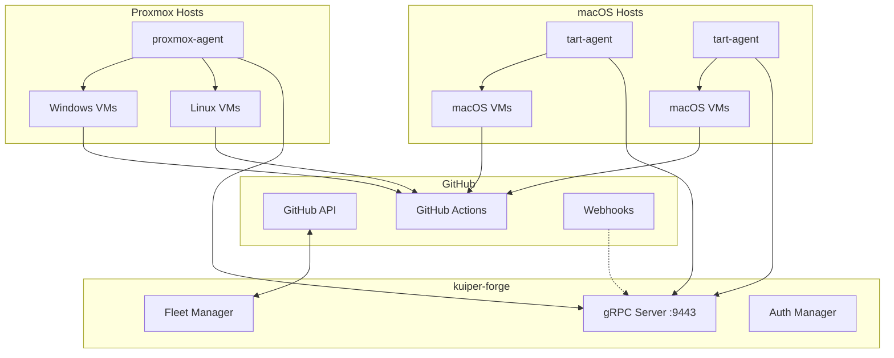

# Kuiper CI Runner Architecture

Simple overview of the system components and their relationships.



## Component Overview

| Component | Description |
|-----------|-------------|
| **kuiper-forge** | Central coordinator - manages fleet, issues mTLS certs, communicates with GitHub API |
| **kuiper-tart-agent** | macOS agent using [Tart](https://tart.run) for VM management (max 2 VMs per host) |
| **kuiper-proxmox-agent** | Linux/Windows agent using Proxmox VE API for VM management |
| **Fleet Manager** | Maintains runner pools (fixed capacity) or handles webhooks (dynamic) |
| **Auth Manager** | Certificate authority for mTLS, token-to-certificate exchange |

## Connection Model

All agents initiate **outbound** connections to the coordinator:

```
Agent ──────► Coordinator
       gRPC + mTLS
       (bidirectional streaming)
```

This allows agents behind NAT/firewalls without port forwarding.
