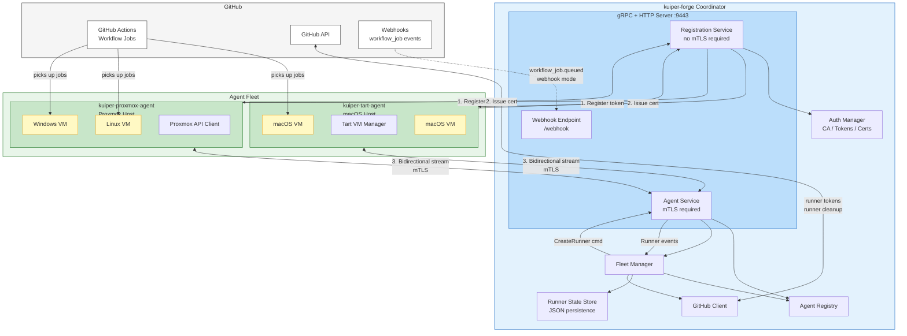

# Component Diagram

Detailed view of kuiper-forge internals and agent communication.

## Data Flow

1. **Agent Registration**: Agent exchanges one-time token for mTLS certificate
2. **Agent Stream**: Bidirectional gRPC stream for commands and events
3. **Runner Creation**: Fleet manager sends `CreateRunner` command to agent
4. **Job Execution**: Ephemeral VM registers with GitHub, runs job, self-destructs
5. **Cleanup**: Agent reports completion, coordinator removes runner from GitHub
