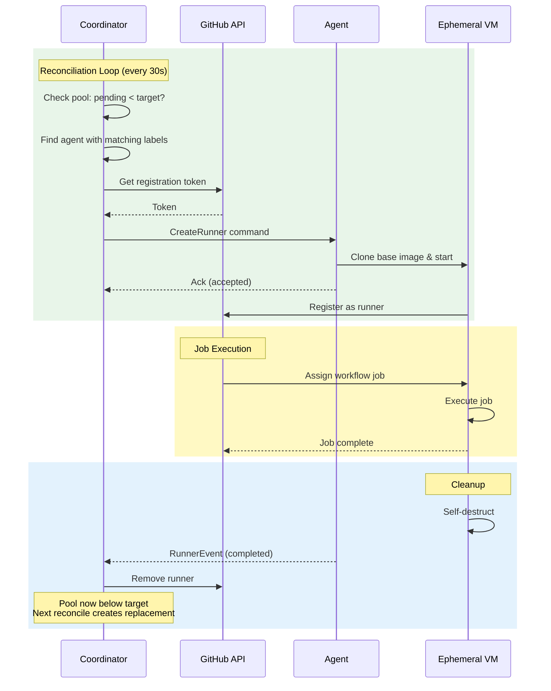
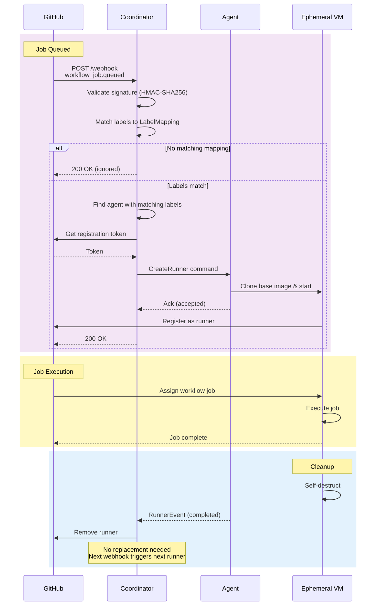

# Provisioning Flow

Sequence diagrams showing how runners are created in each provisioning mode.

## Fixed Capacity Mode

Maintains a constant pool of runners. The coordinator reconciles every 30 seconds.

## Webhook Mode (Dynamic)

Runners created on-demand when GitHub sends `workflow_job.queued` events.

## Comparison

| Aspect | Fixed Capacity | Webhook |
|--------|---------------|---------|
| **Trigger** | 30s reconciliation loop | GitHub webhook event |
| **Pre-provisioning** | Yes - maintains pool | No - just-in-time |
| **Job latency** | Low (runners ready) | Higher (VM boot time) |
| **Resource usage** | Constant | On-demand |
| **Configuration** | `[[runners]]` with `count` | `[[label_mappings]]` |
